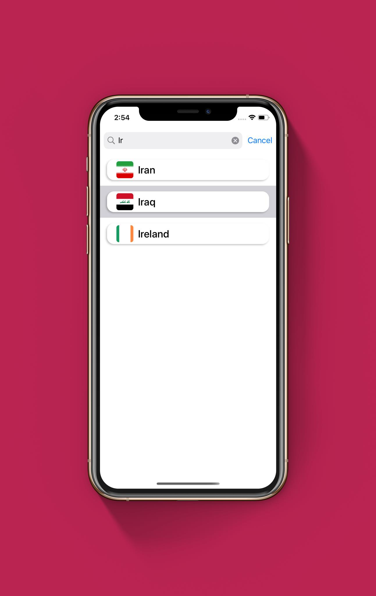
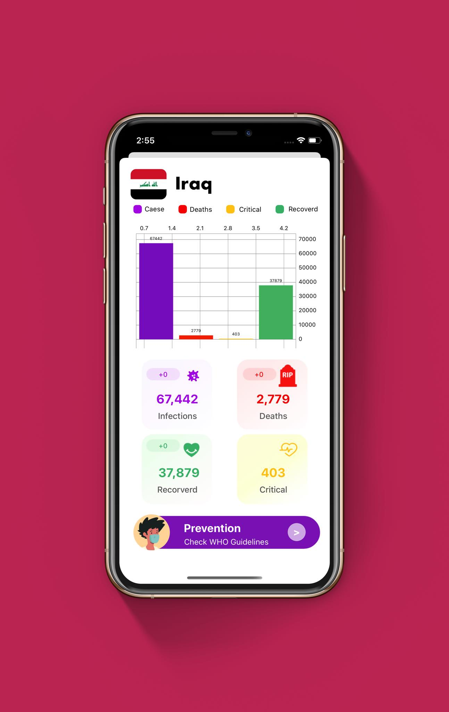

# COVID-19 Tracker
## _Global COVID-19 Cases Tracker_

### About
>This project is an iOS App developed using Swift programming language to display and track COVID-19 cases around the world.

### Features

- View all injuries around the world and injuries per day
- View all deaths around the world and deaths per day
- View all healing cases around the world and healing for one day
- View all critical cases around the world
- View a list of countries most affected by the virus
- View all countries of the world and display the status of each country in relation to the number of total injuries, total deaths, total recovery and total critical cases
- The application automatically updates the statuses every two hours

### API

The API That used in this project from https://corona.lmao.ninja

### Screenshots

  

